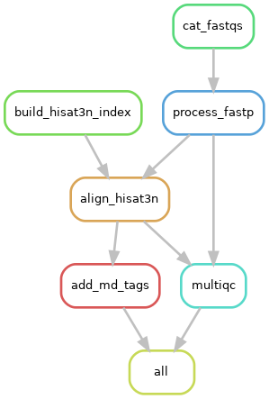

# SLAM-seq rotation project
*Austin Szatrowski, based on a SLAMseq analysis pipeline by Jesse Lehman, Pai Lab @ UMass Med*

## envs:
* `snakemake` is clean snakemake with the slurm execution plugin
* `slamseq_v1` is all (I think) the dependencies for Jesse's SLAM-seq pipeline
* `slamseq_fastp` is all the dependencies plus fastp
* `slamseq_v2` is all the dependencies for Jesse's SLAM-seq pipeline with kallisto 0.50.1 and multiqc
    * kallisto 0.51 encounters a known issue with indexes generated by previous versions ([kallisto:Issue #474](https://github.com/pachterlab/kallisto/issues/474))
    * major packages:
        * `snakemake`
            * `snakemake-executor-plugin-slurm`
            * `snakemake-storage-plugin-http`
        * `fastqc`
        * `fastp`
        * `hisat-3n`
        * `kallisto=0.50.1`
        * `samtools`
        * `multiqc`
        * `openjdk`
        * `fastqc`

## Folders
* `.snakemake`: under-the-hood metadata for DAG creation, plus execution (`log/`) and rule (`slurm_logs/`) log files
* `data`: symlinks to raw `.fastq` data in Hannah's personal folder, plus all intermediate outputs and space for `samtools` temp files. Anything that is too large to be part of a GitHub repo, not human-readable, or isn't an interesting result goes in here
* `outputs`: results, metadata, and QC summary folders. Of note, a _summary_ of the fastp checks go here, but individual reports go in `data`.

## Pipeline
* `setup.sh` is a setup file (run before anything else) that loads the correct python version and conda environment for snakemake, its plugins (slurm executor and http) and all the packages.

### Global inputs
* `*.fastq.gz` compressed sequencing files
* `ref_genome_assembly` a `.fa` reference genome file against which to align. I have used the Barreiro shared hg38 one.

### Outputs
* Read counts (?) this will be a journey of discovery

### Rules

#### `process_fastp`
* Pulls in each sequencing file (R1 and R2 separately), and runs `fastp`, which **includes adapter trimming**
* Output: trimmed fastq sequence files, `html` report and `json` machine-readable metadata
    * saved in `data/trimmed/`

#### `build_hisat3n_index`
* Builds a `hisat-3n` index fileset from a reference `.fa` genome file
* I used the one in Barreiro lab's shared reference directory, seemed to work fine
* Inserts C>T and complementary G>A substitutions in the genome to match the SLAMseq substitutions
* Output: 16 total files
    * `data/hisat3n_indexes/hg38.3n.CT.[1-8].ht2`
    * `data/hisat3n_indexes/hg38.3n.GA.[1-8].ht2`

#### `align_hisat3n`
* Align `data/trimmed/*_R[n]_001.fastq` read files to hg38 using the hg38 hisat-3n reference fileset
* Input: PAIRS of `data/trimmed/*_R[n]_001.fastq` files, since these represent the forward and reversed paired-end adapters used in the same sample
* Output: 
    * `aligned_sam` files, but these are wrapped in `temp()` which **will delete them after all dependent rules (i.e., those that call them as input) have been executed.**
        * that means that once `sam_to_bam` completes for each file/wildcard, the corresponding `.sam` file will be deleted 

#### `sam_to_bam`
* Does what it says on the tin—converts `.sam` files from the previous step to `.bam`.
* Filters out multi-mapped reads (field 260)
* Generates lots of temp files to store data out-of-memory, but assuming successful execution these should be cleaned up
    * I believe they persist if execution fails; unclear whether a restart can make use of them or just builds a new set
* `.sam` files are then discarded because of `temp()` in previous rule

#### `wget_kallisto_index`
* Downloads a pre-built hg38 kallisto index from Pachter Lab's Github storage
#### `decompress_kallisto_index`
#### `kallisto_quant`
#### `generate_tagvalues`
#### `count_nascent_transcripts`

### Rulegraph:
