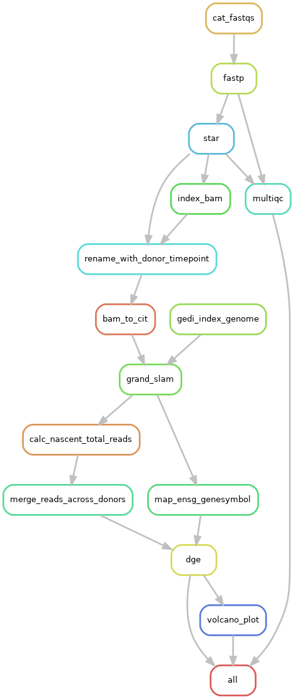

# SLAM-seq rotation project
*January 2026*

*Austin Szatrowski [[email](mailto:aszatrowski@uchicago.edu)], based on a SLAMseq analysis pipeline by Jesse Lehman, Pai Lab @ UMass Med*

### Workflow rulegraph:


## SETUP (START HERE)
To run this pipeline, you will need to (1) set up the conda environment with the relevant packages, (2) build a apptainer/singularity container for GEDI (a SLAM-seq quantification software package), (3) install/update R package dependencies and (4) execute the pipeline use snakemake.

### 1. Build the apptainer container: 
```bash
module load apptainer
apptainer build /project/your-pi/you/containers/gedi_R.sif macrophage-slamseq/gedi.def
```
In `config.yaml`, set `container_path` to `/project/your-pi/you/containers/gedi_R.sif` so snakemake will know where to find it.

This container is like a conda environment, but specifies entire virtual machine, including operating system version and basic software installation, not just specific versions of packages. If you look in the `%post` section of `gedi.def`, you'll see that it installs git, the GEDI installer maven, and R, and uses `git clone` to download and install a pinned version of GEDI. When GRAND-SLAM (from GEDI) is called by its snakemake rule, it gets executed _inside_ the container, and it won't interfere or have dependency conflicts with any other software. This is particularly valuable because (a) GEDI is not available on conda, and (b) it implicitly depends on a specific version of R and several packages.

See the [apptainer docs](https://apptainer.org/docs/user/main/index.html) for details.

### 2. Build the conda environment, and activate it:
```bash
conda create profile/environment.yaml > /path/to/envs/slamseq_v3 
source setup.sh
```
This will extract the packages specified by `environment.yaml`, install or update them as necessary, and place them in `/path/to/envs/slamseq_v3`; replace `/path/to/envs/` with your desired location, and update `setup.sh` with that path.

`(slamseq_v3)` should then appear at the start of your terminal prompt, and all subsequent steps will occur inside that environment, including snakemake itself and the computations it calls.

* `source activate` may be different on your cluster.

### 3. Update R dependencies
Similar to conda, R package versions are pinned in `renv.lock`, very similar to conda's `environment.yaml`. To load the packages and versions used to generate this analysis (guaranteed to work), use `renv::restore()`, which will create a special package location right in the working directory containing all the versions exactly as specified in `renv.lock`. If you haven't used the `renv` package before, install it, and see docs here: [renv docs](https://rstudio.github.io/renv/articles/renv.html).


### 4. Execute the pipeline, using settings in `profile/config.yaml`
```bash
snakemake --workflow-profile ./profile [-np]
```
* `-np` indicates a snakemake dry run, which prints out all the instances of all the rules to be executed and their corresponding shell commands, but doesn't actually execute. Gives an excellent overview of the work to be done, and is useful for debugging.
* `profile/config.yaml` is configured for slurm and UChicago's midway3 architecture; some revisions may be necessary.

## Folders
* `.snakemake`: under-the-hood metadata for DAG creation, plus execution (`log/`) and rule (`slurm_logs/`) log files
* `data`: symlinks to raw `.fastq` data in Hannah's personal folder, plus all intermediate outputs (before clearance by snakemake, see `temp()`) and space for temp files. Anything that is too large to be part of a GitHub repo, not human-readable, or isn't an interesting result goes in here
* `outputs`: results, metadata, and QC summary folders. Of note, a _summary_ of the fastp checks go here, but individual reports go in `data`.


## Global inputs
* `*.fastq.gz` compressed sequencing files
## Input file specification
* As it stands, each input `sample_id` (`/project/pi/path/to/data/{sample_id}.fastq.gz`) should be associated with a donor and a timepoint in `config.yaml` (not to be confused with `profile/config.yaml`, which is used for execution settings.)
    * `sample_id`

## GRAND-SLAM computations
*These are steps carried out by `gedi -e Slam` in `rule grand_slam` that will appear in `logs/grand_slam/{donor}.log`.*
* Reads `.oml` file generated by `Bam2CIT` to learn metadata
* `SlamDetectSNPs`:
    * Look for mismatches highly conserved across samples; these are likely biological SNPs, rather than sequencing errors or 4sU-induced substitutions. These will not be used to call nascent transcripts.
* `SlamCollectStatistics`: 
    * Collecting reads: count reads overlapping every annotated codings sequence in the genome, very similar to `featureCounts` or `bedtools` coverage. Massively sped up by the centered interval tree (CIT) data structure that reduces the amount of search within the genome the counter has to do. Represents ~95% of processing time.
    * Writing statistics: record substitution rates and mismatch positions in corresponding output files.
    * Running R scripts for plotting: invoke installed R and R packages to generate mismatch plots.
* `SlamRates` 
    * Determine substitution rates based on mismatches, excluding previously-determined SNPs.
    * If there are warnings about too few reads for calling in one or more samples, they will appear here.
    * Plots total subsitution rates plots
* `SlamInfer`
    * Calculate nascent-to-total ratio (NTR) per gene using substitution rates
    * Generates intronic-exonic read plot.

## Output Files
```
outputs/
├── readcounts/
│   ├── merged_counts_nascent.csv       # Gene × sample count matrix (nascent RNA)
│   └── merged_counts_total.csv         # Gene × sample count matrix (total RNA)
├── dge_results/
│   ├── summary_stats_nascent.csv       # edgeR results for all comparisons (nascent)
│   └── summary_stats_total.csv         # edgeR results for all comparisons (total)
├── volcano_plots/
│   ├── volcanoplot_nascent-{time}_vs_0m.pdf    # Per-timepoint volcano plots (nascent)
│   └── volcanoplot_total-{time}_vs_0m.pdf      # Per-timepoint volcano plots (total)
├── venn_diagrams/
│   └── venn_{time}_vs_0m.png           # Overlap of nascent/total DEGs per timepoint
├── effect_size_correlations/
│   └── corr_{time}_vs_0m.pdf           # log2FC correlation between nascent and total
├── timecourse_dge_plot_nascent.pdf       # log2FC at each timepoint for top DE genes across timepoints (nascent)
├── timecourse_dge_plot_total.pdf       # log2FC at each timepoint for top DE genes across timepoints (total)
├── rulegraph.png                        # Snakemake workflow DAG
├── multiqc_report.html                  # Aggregated QC metrics
└── multiqc_data/                        # Raw MultiQC data files
```

**Timepoints**: 15, 30, 60, 90, 105, 120 minutes (all comparisons vs 0m baseline)

## Configuration
In general, snakemake will submit each job (one rule, executing for one input) in the workflow as its own `sbatch` job. The SBATCH arguments are specified in `profile/config.yaml`:
```
executor: slurm # use slurm
cores: 32 # maximum cores during execution, shared across jobs
jobs: 8 # number of parallel jobs to run
use-singularity: true # activate singularity for container
singularity-args: "--bind /project/lbarreiro,/scratch/midway3/$USER" # give container access to all of lbarreiro & personal scratch
default-resources:
  slurm_account: pi-lbarreiro 
  slurm_partition: lbarreiro
```

Rules listed in under `localrules:` in the `snakefile` are so lightweight that they can run directly on the login node, and the time spent waiting for the job to submit to slurm simply isn't worth it. These rules are generally file copying, renaming, or linking operations, and all of the plot generation.

## Approximate timing
* `cat_fastqs`: seconds
* `fastp`
    * 4 cores: ~45-60 min per sample
* `star`
    * 8 threads: ~1hr/10G of trimmed reads
* `bam_to_cit`: 18h for ~150G of aligned BAMs
* `grand_slam`: 
    * 16 threads: 5h for 76G CIT file
    * 30 threads: 2.5h for 76G CIT file
* All R-based rules (everything downstream of `grand_slam` in the rulegraph): 5-15 seconds per job